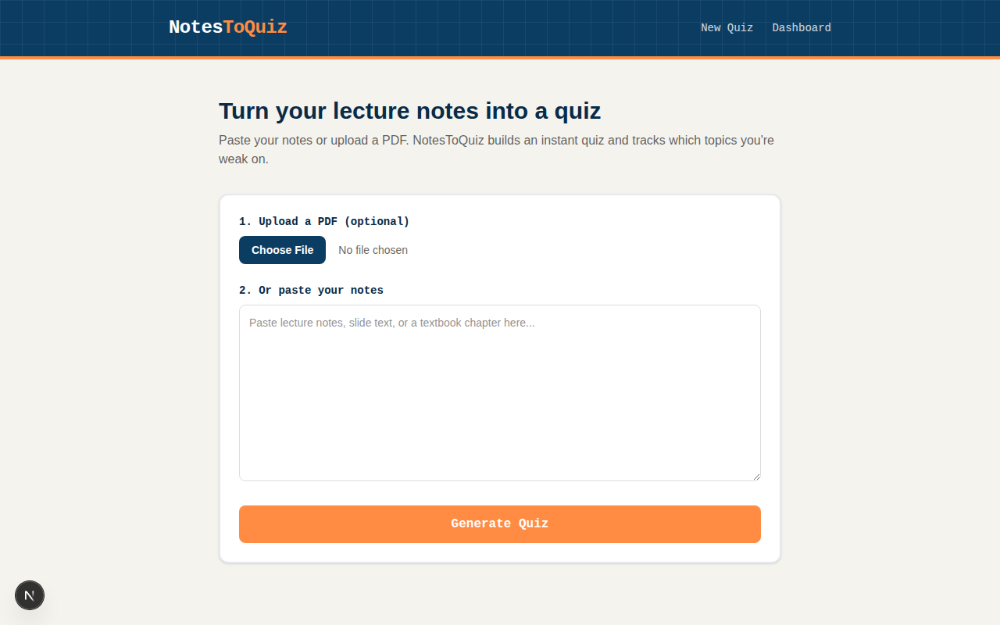
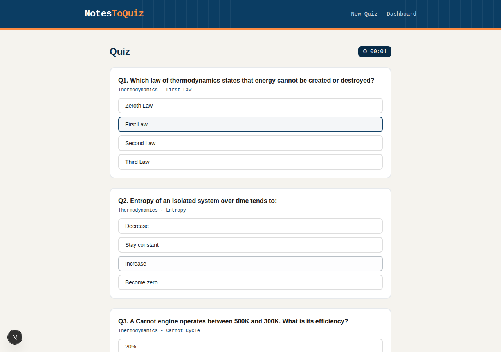
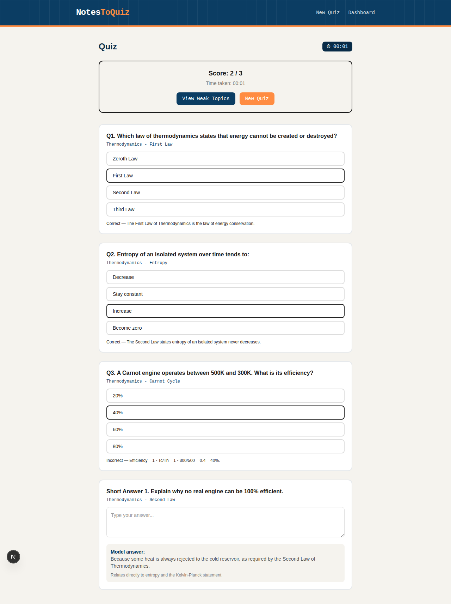
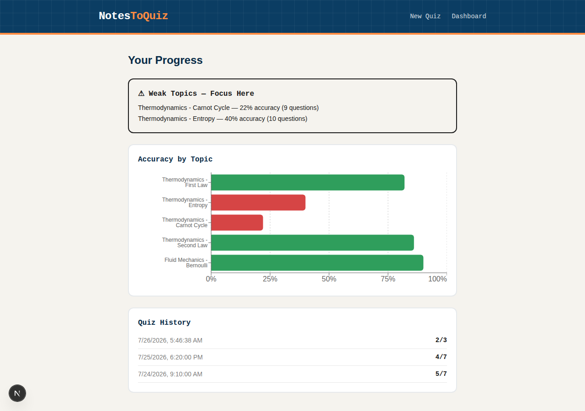

# NotesToQuiz — Turn Your Notes Into Quizzes

**NotesToQuiz** is an AI-powered study tool built for engineering students. Paste your
lecture notes (or upload a PDF), and NotesToQuiz instantly generates a quiz from them,
grades it, and tracks which topics you're weak on — so you know exactly what to revise
before an exam.

## Live URL

🔗 **[https://notestoquiz.vercel.app](https://notestoquiz.vercel.app)** *(replace with your actual deployed URL)*

## The Problem It Solves

Engineering students accumulate huge amounts of lecture material (slides, PDFs, scanned
notes) but rarely turn that material into active practice before exams — most revision is
just re-reading, which is one of the least effective study methods. NotesToQuiz closes that
gap: it converts *any* notes a student already has into an active-recall quiz in seconds,
and keeps a running record of which specific subtopics they keep getting wrong, so
revision time goes to the topics that actually need it.

**Who it's for**: university students (built with an engineering curriculum in mind, but
works for any subject) who want a fast, free way to self-test on their own material
instead of generic pre-made question banks.

## Features

- **Two ways to get notes in**: paste text directly, or upload a PDF (text is extracted
  automatically)
- **AI-generated quiz**: 5 multiple-choice questions + 2 short-answer questions per set,
  generated from the actual notes provided — not a generic question bank
- **Quiz timer**: tracks how long each attempt takes
- **Instant grading**: MCQs are graded the moment you submit
- **Explanation for every answer**: right or wrong, you see *why*
- **Model answers**: short-answer questions come with a model answer to compare against
- **Weak-topic tracking**: every question is tagged with a specific subtopic; NotesToQuiz
  aggregates accuracy per topic across all quizzes you've taken
- **Progress dashboard**: a bar chart of accuracy by topic (topics under 60% are flagged
  as weak) plus full quiz history with scores and time taken

## The AI Feature

**What it does**: Given raw lecture notes as text, the AI reads the content and generates
a structured quiz (5 MCQs + 2 short-answer questions), where every question is tagged with
the specific subtopic it tests. This tagging is what powers the weak-topic dashboard — the
AI isn't just generating questions, it's classifying them, which turns a one-off quiz into
a longitudinal tracking system.

**Model used**: Google Gemini (`gemini-2.5-flash`) via the Gemini API free tier.

**The system prompt** (in `lib/gemini.js`):

```
You are a quiz generator for engineering students.
Given lecture notes, generate exactly 5 multiple-choice questions and 2 short-answer questions
that test conceptual understanding, not just memorization.

For each multiple-choice question include: the question text, 4 options, the index (0-3) of the
correct option, a short explanation, and a "topic" tag (a short 2-4 word label for the specific
subtopic it covers, e.g. "Thermodynamics - Entropy").

For each short-answer question include: the question text, a model answer, a short explanation,
and a "topic" tag.

Keep questions relevant to engineering coursework (formulas, applications, problem-solving)
rather than trivial recall where possible.

Return ONLY valid JSON, no markdown fences, no preamble, matching exactly this shape: [...]
```

The model is called with `responseMimeType: "application/json"` so the response is
parsed directly into the quiz UI with no manual cleanup needed.

## Tools, Services & Models Used

| Purpose | Tool |
|---|---|
| Framework | Next.js 16 (App Router) |
| Styling | Tailwind CSS v4 |
| AI model | Google Gemini API (`gemini-2.5-flash`, free tier) |
| PDF text extraction | `pdf-parse` (v2) |
| Charts | `recharts` |
| Hosting | Vercel |
| Data storage | Browser `localStorage` (quiz history, weak-topic stats — no backend database needed) |

## Screenshots

**1. Home — upload or paste notes**


**2. Taking a quiz (timer + live answer selection)**


**3. Instant results with per-question explanations**


**4. Weak-topic dashboard**


## How to Run the Project

### Prerequisites
- Node.js 18+
- A free Gemini API key from [aistudio.google.com](https://aistudio.google.com)

### Local setup

```bash
git clone <your-repo-url>
cd studyforge
npm install
```

Create a `.env.local` file in the project root:

```
GEMINI_API_KEY=your_gemini_api_key_here
```

Run the dev server:

```bash
npm run dev
```

Open [http://localhost:3000](http://localhost:3000).

### Deploying to Vercel

1. Push this repo to GitHub (public).
2. Go to [vercel.com](https://vercel.com) → **Import Project** → select the repo.
3. In **Environment Variables**, add `GEMINI_API_KEY` with your key.
4. Deploy. Vercel gives you a live URL automatically.

## Project Structure

```
studyforge/
├── app/
│   ├── page.js                    # Home — upload/paste notes, trigger quiz generation
│   ├── quiz/page.js                # Quiz-taking UI, timer, grading
│   ├── dashboard/page.js           # Weak-topic chart + quiz history
│   └── api/
│       ├── generate-quiz/route.js  # Calls Gemini API, returns structured quiz JSON
│       └── extract-pdf/route.js    # Extracts text from uploaded PDF
├── lib/
│   └── gemini.js                   # Gemini API call + system prompt
├── components/
│   └── Nav.js                      # Shared navigation bar
└── screenshots/                    # Screenshots used in this README
```

## Notes

- All quiz history and weak-topic stats are stored in the browser's `localStorage` —
  no login or database is required to use the app. This keeps the app fully functional
  end-to-end without any paid backend service.
- The Gemini API free tier is used, which has generous but non-infinite daily limits —
  more than enough for demo/grading use.

## Author

**Ali Hassan**
Individual project — built solo for the Final Project assignment (Week 7).
